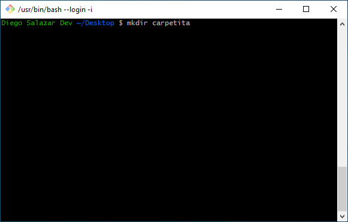
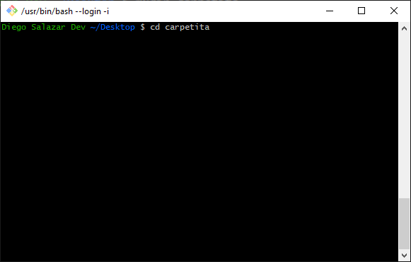
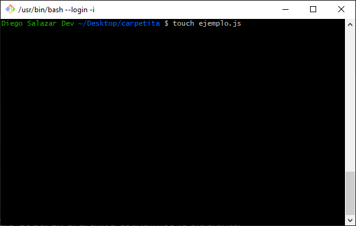
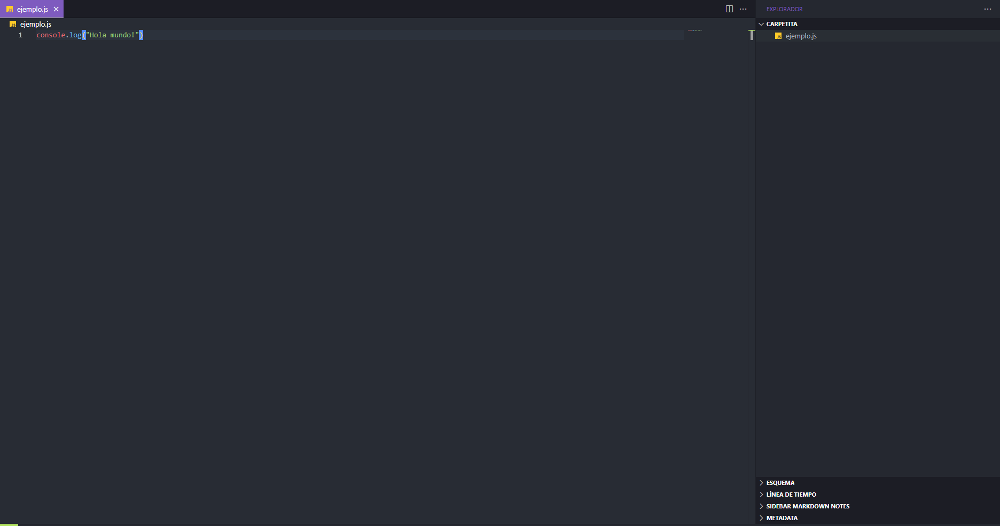
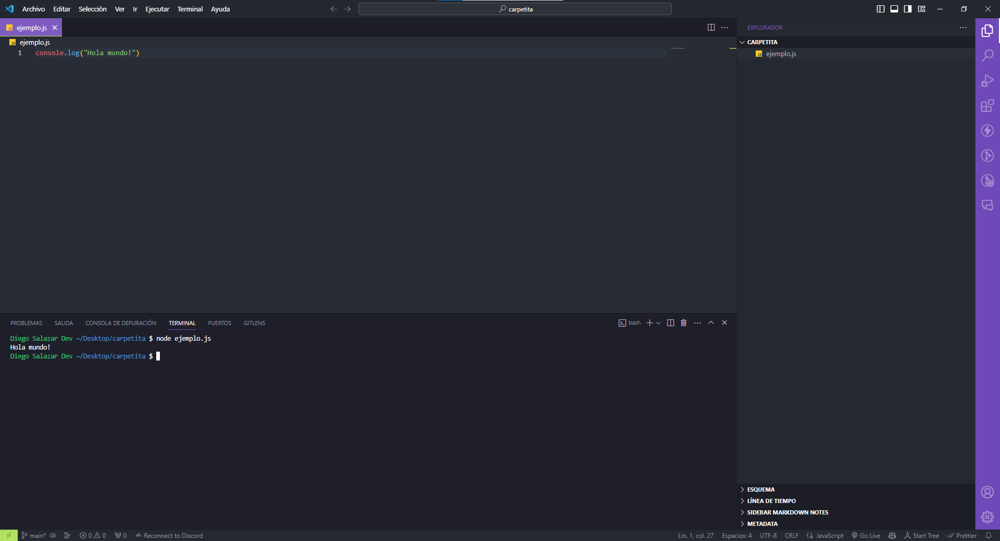
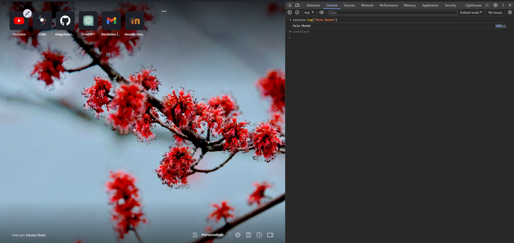
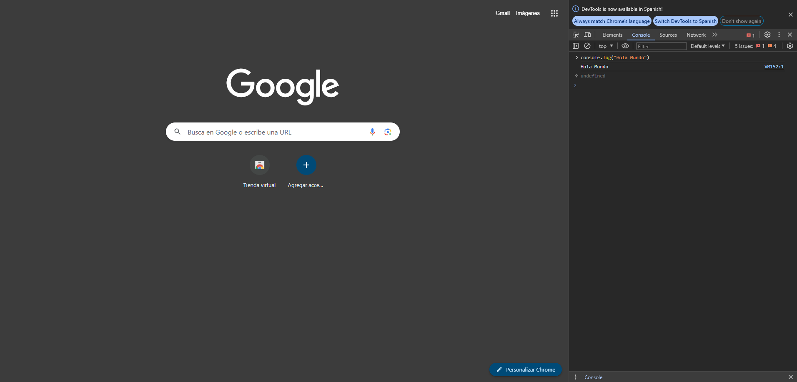

## Hola Mundo con JavaScript

#### Opción 1

Para hacer nuestro primer `Hola Mundo!` en JavaScript debemos:

1. Abrir la consola de preferencia, en este caso será la gitbash.

2. Crear un nuevo directorio con el comando `mkdir <nombre_directorio`.

3. Moverse a ese directorio con el comando `cd <nombre_directorio>`.

4. Crear un nuevo archivo con el comando `touch <nombre_archivo>.js`.

5. Una vez alojado en la ruta donde se encuentra el archivo, colocamos el comando `code <nombre_archivo>.js` para abrir Visual Studio Code.

6. Se nos abrirá una ventana del Visual Studio Code. En el archivo escribimos lo siguiente:

7. Abrimos una nueva terminal y escribimos el comando `node ejemplo.js`. El resultado por consola será el siguiente:

#### Opción 2

- En nustro navegador de preferencia abrimos la consola con `Ctrl + Shift + i`.
- Luego escribimos `console.log("Hola Mundo!")` y presionamos `Enter`.

##### Brave

##### Chrome

