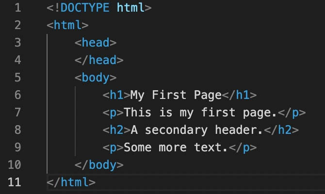
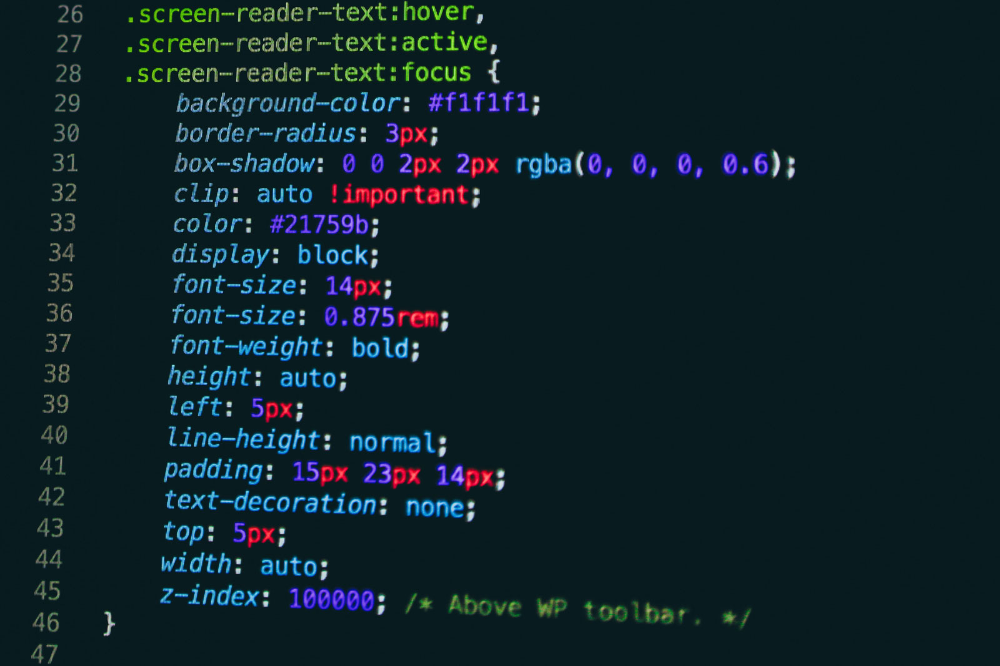

## Tecnologias a utilizar en el lado del cliente

### HTML

- HTML Significa Lenguaje de Marcado de Hipertexto, es el lenguaje de marcado estándar para documentos diseñados para ser mostrados en un navegador web. Es uno de los componentes fundamentales de la World Wide Web y se utiliza para definir la estructura y el contenido de las páginas web. HTML consta de una serie de elementos, que se utilizan para encerrar o envolver diferentes partes del contenido para hacerlo aparecer o actuar de una manera determinada. Los elementos de HTML están representados por etiquetas.

### CSS

- CSS Significa Hojas de Estilo en Cascada, es un lenguaje de hoja de estilos que se utiliza para describir el aspecto de un documento escrito en HTML o XML. CSS describe cómo se deben mostrar los elementos en la pantalla, en papel, en voz o en otros medios. Es uno de los lenguajes fundamentales de la web y permite a los desarrolladores controlar cosas como los colores, las fuentes, el espaciado y las animaciones en las páginas web. CSS es esencial para la creación de sitios web modernos y responsivos.

### JavaScript

- JavaScript del lado del cliente se refiere a la funcionalidad de JavaScript que se ejecuta en el navegador web del usuario, en lugar de en un servidor. Esto permite crear interfaces de usuario interactivas, validación de formularios en tiempo real, diferentes tipos de animación, y mucho más. Se pueden realizar interfaces de usuario en la web debido a su integración con HTML y CSS. Con JavaScript, los desarrolladores pueden tomar una página web estática y transformarla en una experiencia de usuario dinámica. Además, con la introducción de las API web y las bibliotecas y frameworks modernos de JavaScript, las posibilidades de lo que se puede hacer en el lado del cliente se han ampliado enormemente, permitiendo la creación de aplicaciones web de una sola página (SPA) que ofrecen una experiencia de usuario similar a la de una aplicación de escritorio o móvil.

### React

React es una biblioteca de JavaScript de código abierto desarrollada por Facebook para construir interfaces de usuario interactivas y eficientes. React se centra en la construcción de componentes reutilizables que representan piezas específicas de la interfaz de usuario y gestiona de manera eficiente las actualizaciones del DOM (Document Object Model) para mejorar el rendimiento de las aplicaciones web.

- Documentación recomendada: [**https://es.react.dev/learn**](https://es.react.dev/learn)

Algunas características clave de React:

1. Componentes Reutilizables:
    - React organiza la interfaz de usuario en componentes reutilizables. Cada componente encapsula una pieza específica de la interfaz y puede incluir su propio estado y comportamiento.
2. Virtual DOM:
    - React utiliza un Virtual DOM para mejorar el rendimiento. En lugar de actualizar directamente el DOM cada vez que cambia el estado de la aplicación, React actualiza primero un Virtual DOM y luego compara este Virtual DOM con el DOM real para realizar actualizaciones eficientes.
3. Declarativo:
    - React sigue un enfoque declarativo, lo que significa que los desarrolladores especifican "qué" resultado desean lograr y no necesariamente "cómo" lograrlo. Esto facilita la comprensión del código y el mantenimiento.
4. SX (JavaScript XML):
    - React utiliza JSX, una extensión de JavaScript que permite escribir código que parece HTML dentro de archivos JavaScript. JSX facilita la construcción de interfaces de usuario de manera más declarativa y visual.
5. Unidireccionalidad de Datos:
    - React sigue el principio de unidireccionalidad de datos, lo que significa que el flujo de datos se mueve en una sola dirección, desde el componente principal a los componentes secundarios. Esto facilita el seguimiento de los cambios y la depuración.
6. React Hooks:
    - Los Hooks son una característica introducida en React 16.8 que permite a los desarrolladores utilizar el estado y otras características de React en componentes basados en funciones, en lugar de solo en componentes de clase.
7. Flujo de Desarrollo Eficiente:
    - React proporciona un conjunto de herramientas y extensiones de navegador que facilitan el desarrollo, la depuración y el rendimiento de las aplicaciones React.
8. Comunidad Activa y Ecosistema:
    - React cuenta con una comunidad activa de desarrolladores y un amplio ecosistema de bibliotecas y herramientas de terceros que complementan y extienden su funcionalidad.
9. Integración con Otros Frameworks:
    - React puede integrarse con otros frameworks y bibliotecas fácilmente. Por ejemplo, se utiliza comúnmente con React Router para la gestión de rutas en aplicaciones de una sola página (SPA).

React se ha vuelto extremadamente popular en el desarrollo de interfaces de usuario modernas y es utilizado por muchas empresas para construir aplicaciones web complejas y eficientes. Además, React Native, una extensión de React, se utiliza para construir aplicaciones móviles nativas para plataformas como iOS y Android.
