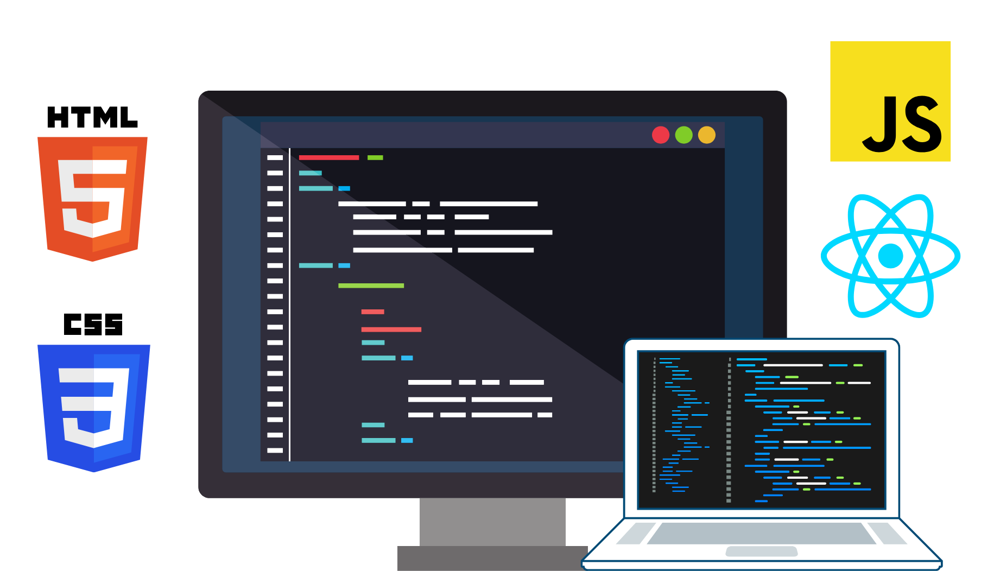

## Desarrollador Frontend

El desarrollador frontend se encarga de todo lo que el usuario ve e interactúa en una página web, incluyendo el diseño y la disposición de los elementos en la página. Utilizan tecnologías como HTML, CSS y JavaScript para crear interfaces de usuario atractivas y funcionales.

Además, este rol implica a menudo trabajar estrechamente con los desarrolladores backend para integrar la lógica del servidor con los elementos de la interfaz de usuario. La experiencia en frameworks de JavaScript como React o Vue puede ser especialmente valiosa.

