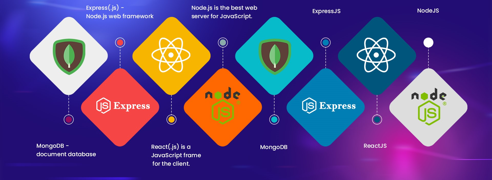

## Desarrollador Full Stack

Un desarrollador Full Stack puede trabajar tanto en el frontend como en el backend de una aplicación web. Tienen un conocimiento amplio de las diferentes tecnologías utilizadas en ambos lados y pueden crear una aplicación web completa por sí mismos.

Esto incluye la gestión de bases de datos, el diseño de la interfaz de usuario, la programación del servidor, la implementación de APIs, entre otras tareas. Como resultado, son muy valorados en la industria del desarrollo web debido a su versatilidad y habilidades completas.

