## Comandos

### Ciclo básico de subida de archivos a GitHub!

### Pasos a seguir

1. Nos alojamos en la ruta de nuestro escritorio y verificamos que estemos efectivamente en la ruta deseada:

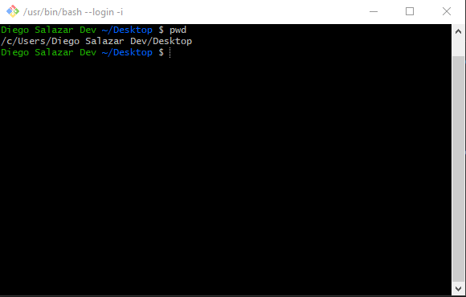

2. Creamos un directorio con `mkdir <nombre_directorio>`, nos movemos a nuestro directorio con el comando `cd <nombre_directorio>`:

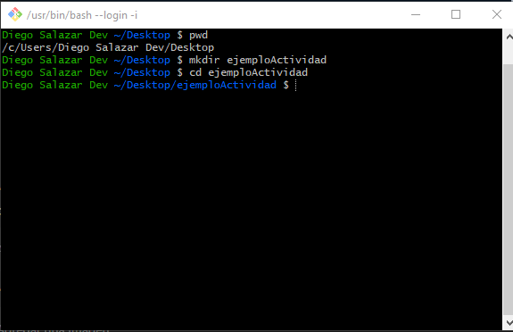

3. Creamos un archivo README.md con el comando `touch README.md`:

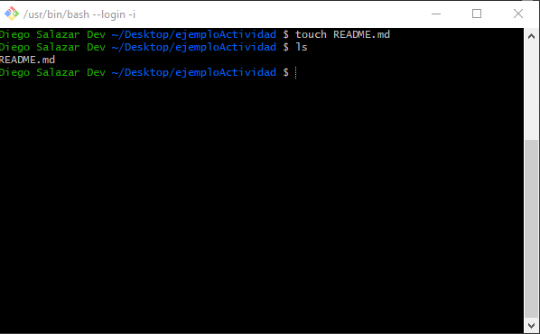

4. Abrimos nuestro **Visual Studio Code** con el comando `code .` y luego `ENTER`:

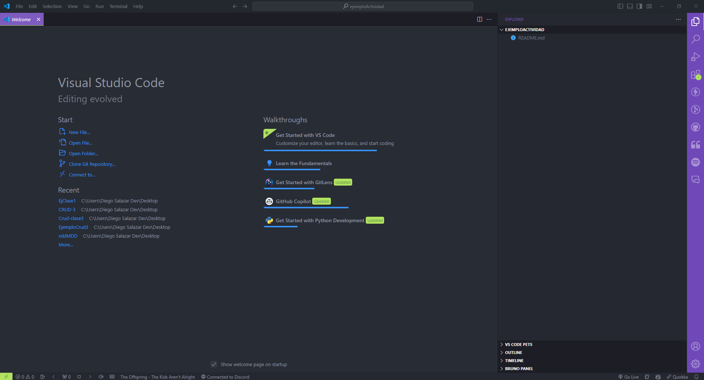

5. Clickeamos nuestro archivo `README.md` y luego procedemos a modificar a nustro gusto el archivo:

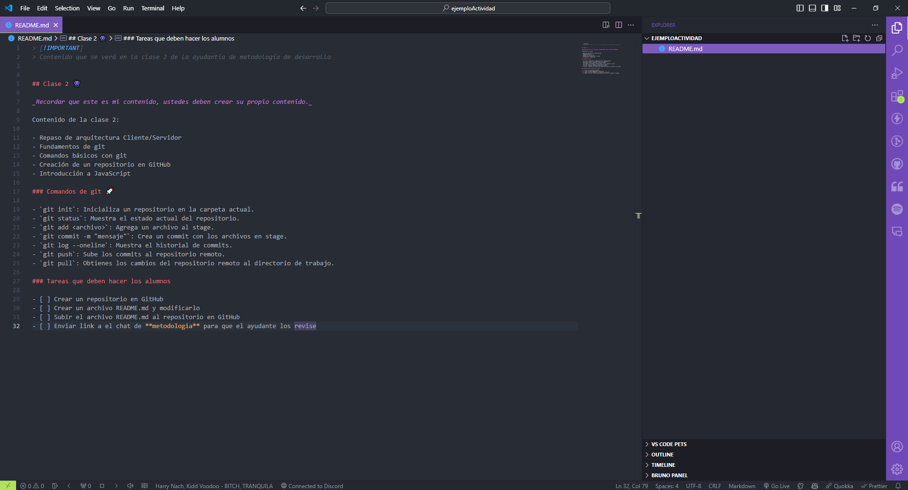

6. Abrir la terminal y hacer un `git init`, para iniciar nuestro repositorio de git:

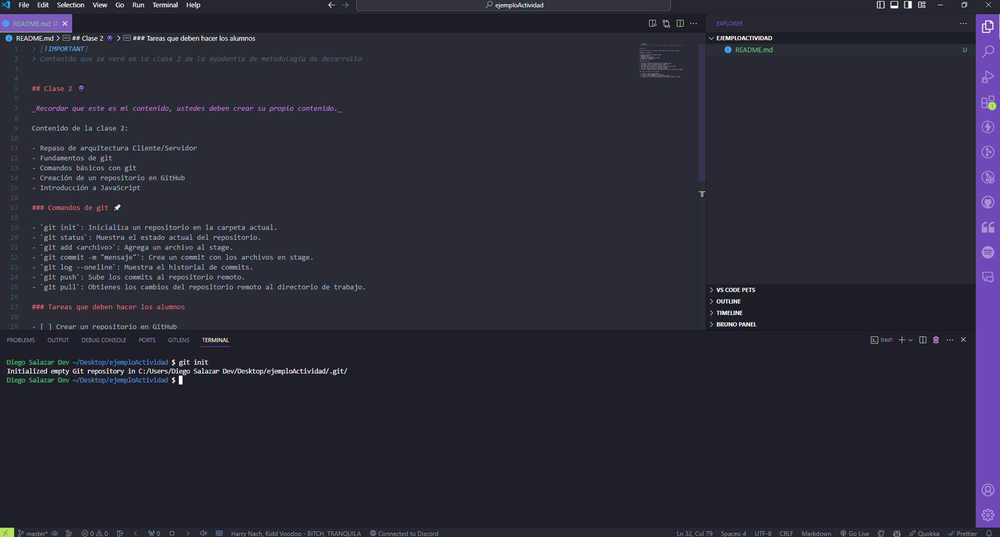

7. Hacer un `git status`, para verificar el estado de nuestro archivo **README.md**:

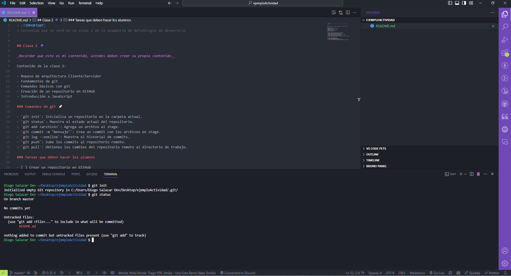

8. Agregar nuestro archivo **README.md** al área de preparación (staging) con el comando `git add <archivo>` y verificar el estado del archivo de nuevo con `git status`:

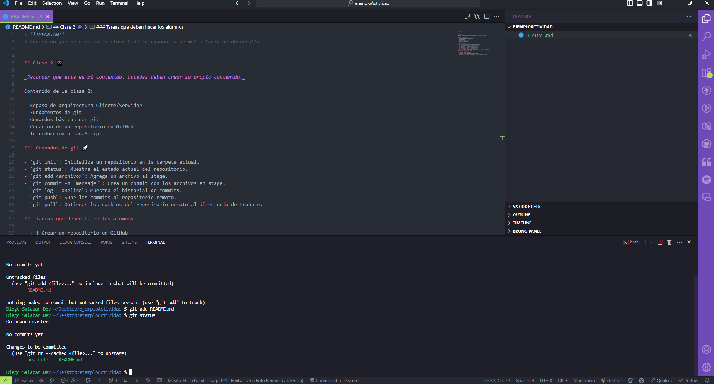

9. Hacer un commit para subir nuestro archivo al repositorio de git con el comando `git commit -m "msj"`:

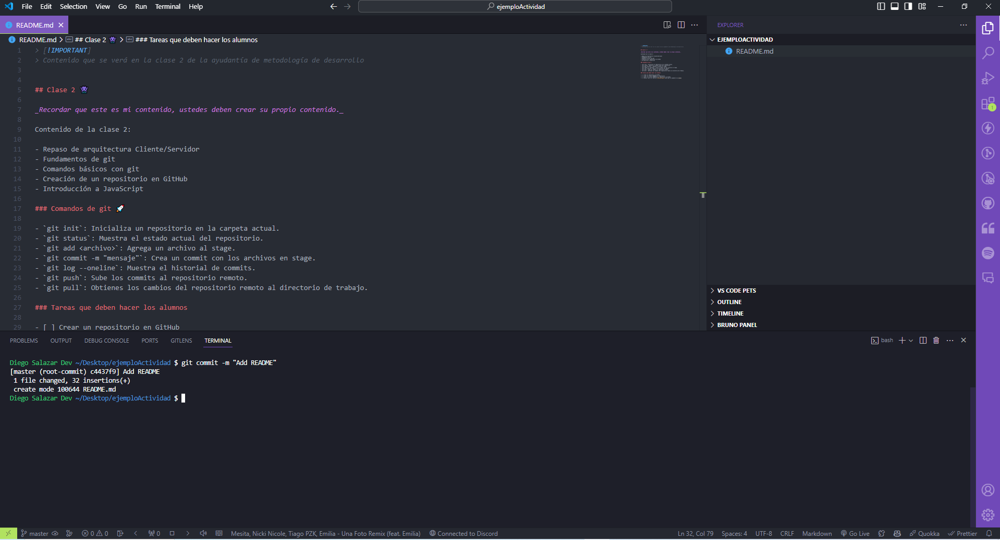

10. Con el comando `git remote add origin <URL_Repositorio_GitHub>` apuntamos a nuestro repositorio en GitHub:

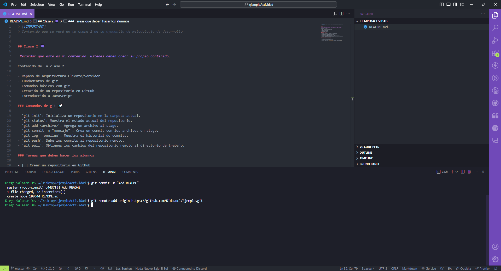

11. Seguimos con el comando `git branch -M main`, que nos sirve para modificar el nombre de la rama que se crea por defecto. Por lo que pasa de `master` a `main`.

12. Por ultimo colocamos el comando `git push -u origin main`, para empujar nuestros cambios que tenemos en nuestro repositorio de git hacia nuestro repositorio remoto en GitHub:

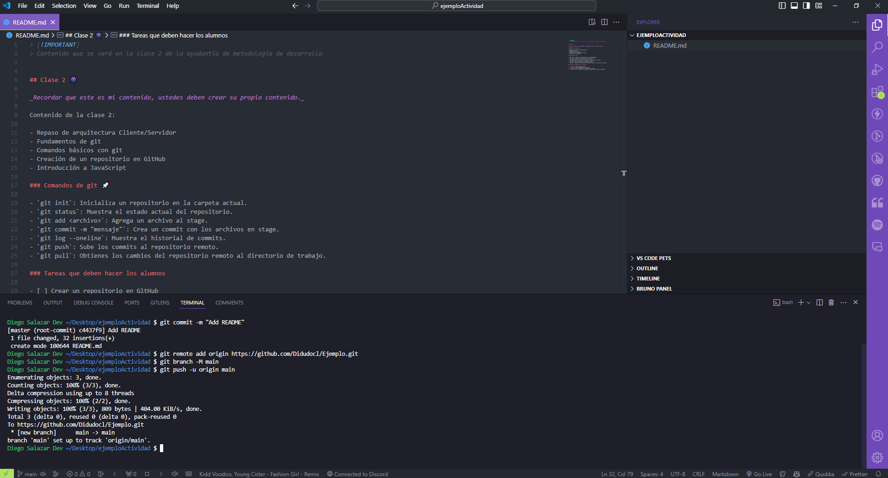

13. Si vamos a nuestro repositorio en GitHub y le damos `refresh` a la página, nos encontramos con nuestro archivo **README.md** subido:

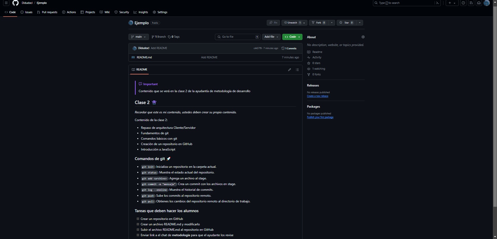

