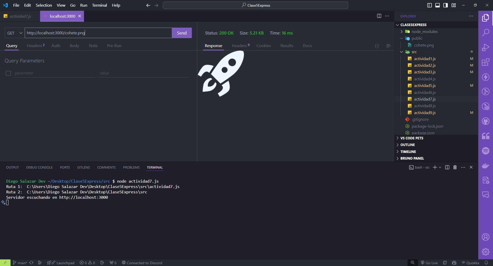

## Servir archivos estáticos

### Servir archivos estáticos con Express.js

Requisitos:

- Tener instalado **Visual Studio Code**.
- Dentro de **Visual Studio Code** instalar la extensión llamada **Thunder Client**.
- Tener instalada la versión actualizada de **Node.js 20.11.0 LTS.**
- Tener las ganas de aprender y programar! 🚀🚀🚀

### Código

```javascript
import express from 'express';
import path from 'path';
import { fileURLToPath } from 'url';

// Obtener el nombre del archivo actual y su directorio
const __filename = fileURLToPath(import.meta.url);
console.log("Ruta 1: ", __filename);
const __dirname = path.dirname(__filename);
console.log("Ruta 2: ", __dirname);

const app = express();
const port = 3000;

// Servir archivos estáticos desde la carpeta 'public'
app.use(express.static(path.join(__dirname, '../public')));

// Método de express para levantar un servidor y que escuche en un puerto determinado.
app.listen(port, () => {
    console.log(`Servidor escuchando en http://localhost:${port}`);
});
```

### Resultado al realizar la petición con Thunder Client a la ruta http://localhost:3000/<nombreImagen.extensión>

- Se debe levantar el servidor antes con el comando: `node <nombreArchivo.js>` .

