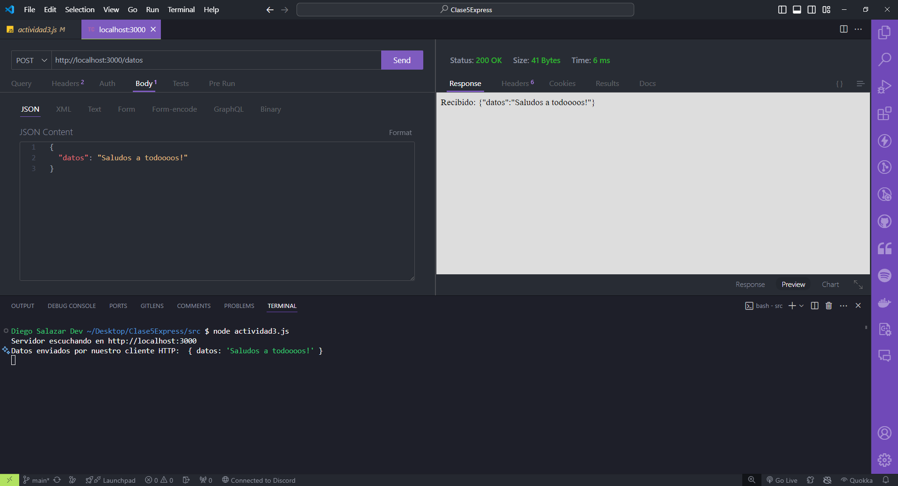

## Utilizando req.body

### Utilizando req.body con Express.js

Requisitos:

- Tener instalado **Visual Studio Code**.
- Dentro de **Visual Studio Code** instalar la extensión llamada **Thunder Client**.
- Tener instalada la versión actualizada de **Node.js 20.11.0 LTS.**
- Tener las ganas de aprender y programar! 🚀🚀🚀

### Código

```javascript

import express from 'express';

const app = express();
const port = 3000;

app.use(express.json()); // Para parsear JSON (middleware)

app.post('/datos', (req, res) => {
  const datos = req.body;
  console.log("Datos enviados por nuestro cliente HTTP: ", datos);
  res.send(`Recibido: ${JSON.stringify(datos)}`);
});


app.post('/nuevos-datos', (req, res) => {
  const nuevosDatos = req.body;
  res.send(`Nuevos datos recibidos: ${JSON.stringify(nuevosDatos)}`);
});

// Metodo de express para levantar un servidor y que escuche en un puerto determinado.
app.listen(port, () => {
    console.log(`Servidor escuchando en http://localhost:${port}`);
})    
```

### Resultado al realizar la petición con Thunder Client a la ruta http://localhost:3000/datos

- Se debe levantar el servidor antes con el comando: `node <nombreArchivo.js>` .
- Utilizaremos Thunder Client para enviarle datos por el cuerpo de la solicitud (body), todo esto en formato JSON.



### Resultado al realizar la petición con Thunder Client a la ruta http://localhost:3000/nuevos-datos

- Se debe levantar el servidor antes con el comando: `node <nombreArchivo.js>` .
- Utilizaremos Thunder Client para enviarle datos por el cuerpo de la solicitud (body), todo esto en formato JSON.

