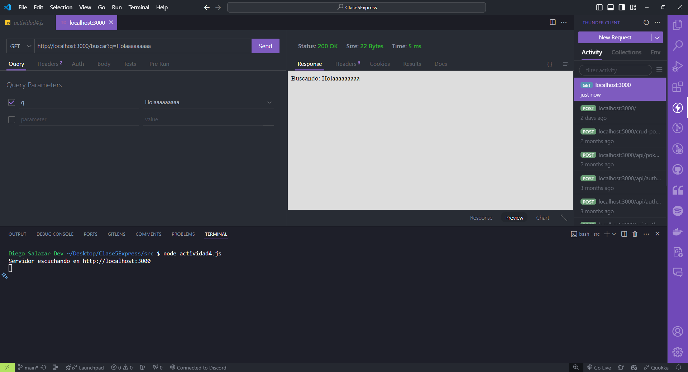
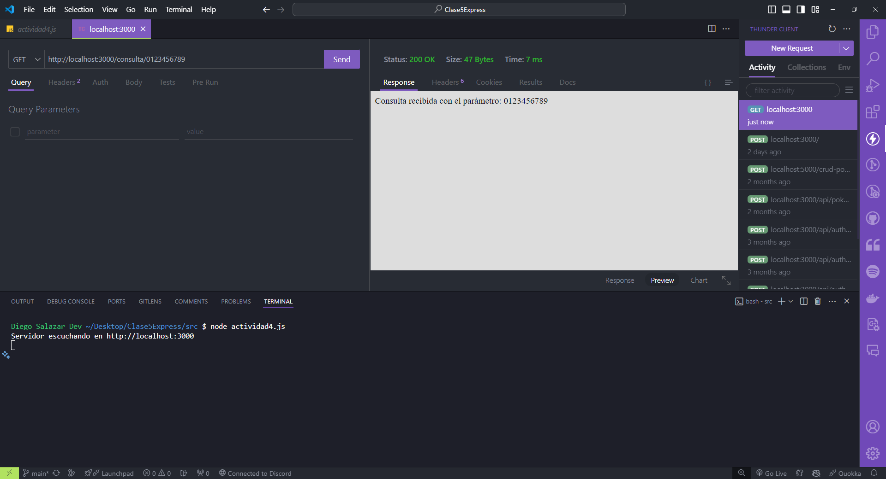

## Utilizando req.query y req.params

### Utilizando req.query y req.params con Express.js

Requisitos:

- Tener instalado **Visual Studio Code**.
- Dentro de **Visual Studio Code** instalar la extensión llamada **Thunder Client**.
- Tener instalada la versión actualizada de **Node.js 20.11.0 LTS.**
- Tener las ganas de aprender y programar! 🚀🚀🚀

### Código

```javascript
import express from 'express';

const app = express();
const port = 3000;

app.get('/buscar', (req, res) => {
  const query = req.query.q;
  res.send(`Buscando: ${query}`);
});
  
app.get('/consulta/:id', (req, res) => {
  const parametro = req.params.id;
  res.send(`Consulta recibida con el parámetro: ${parametro}`);
});
  
// Metodo de express para levantar un servidor y que escuche en un puerto determinado.
app.listen(port, () => {
    console.log(`Servidor escuchando en http://localhost:${port}`);
})
```

### Resultados al realizar la petición con Thunder Client a la ruta http://localhost:3000/buscar?q=Holaaaaaa

- Se debe levantar el servidor antes con el comando: `node <nombreArchivo.js>`.



### Resultados al realizar la petición con Thunder Client a la ruta http://localhost:3000/consulta/123

- Se debe levantar el servidor antes con el comando: `node <nombreArchivo.js>`.

