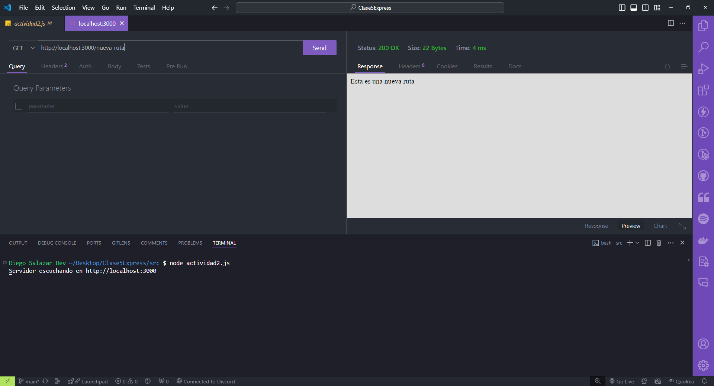
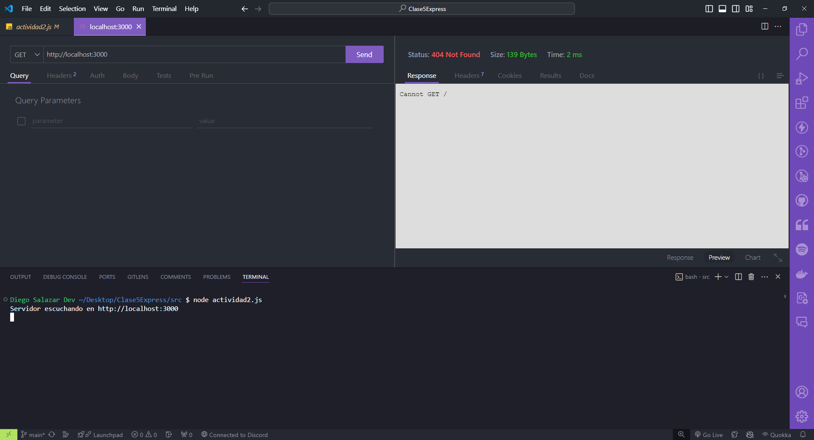

## Rutas básicas

### Rutas básicas con Express.js

Requisitos:

- Tener instalado **Visual Studio Code**.
- Tener instalada la versión actualizada de **Node.js 20.11.0 LTS.**
- Dentro de **Visual Studio Code** instalar la extensión llamada **Thunder Client**.
- Tener las ganas de aprender y programar! 🚀🚀🚀

### Código

```javascript
import express from 'express';

const app = express();
const port = 3000;

app.get('/ruta', (req, res) => {
    res.send('Esta es una ruta básica');
  });
  
app.get('/nueva-ruta', (req, res) => {
    res.send('Esta es una nueva ruta');
});

// Metodo de express para levantar un servidor y que escuche en un puerto determinado.
app.listen(port, () => {
    console.log(`Servidor escuchando en http://localhost:${port}`);
})
```

### Resultados al ingresar a la ruta http://localhost:3000/ruta

- Se debe levantar el servidor antes con el comando: `node <nombreArchivo.js>`.


### Resultados al ingresar a la ruta http://localhost:3000/nueva-ruta

- Se debe levantar el servidor antes con el comando: `node <nombreArchivo.js>`.



### ¿Qué pasa si accedemos a la ruta raíz del servidor?

- La ruta raíz es: `http://localhost:3000/`.

